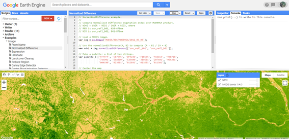
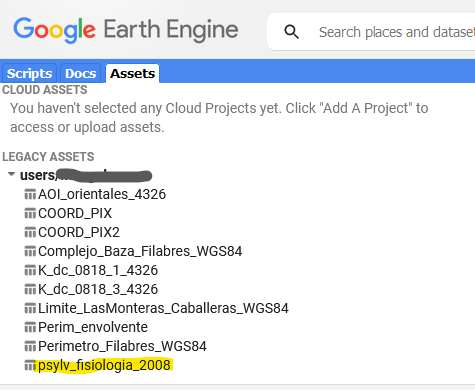
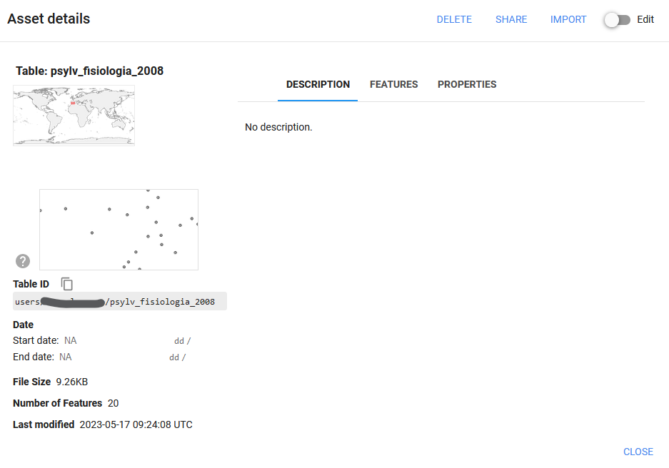
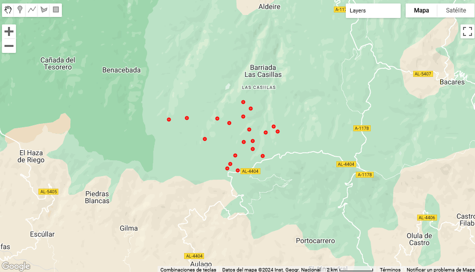
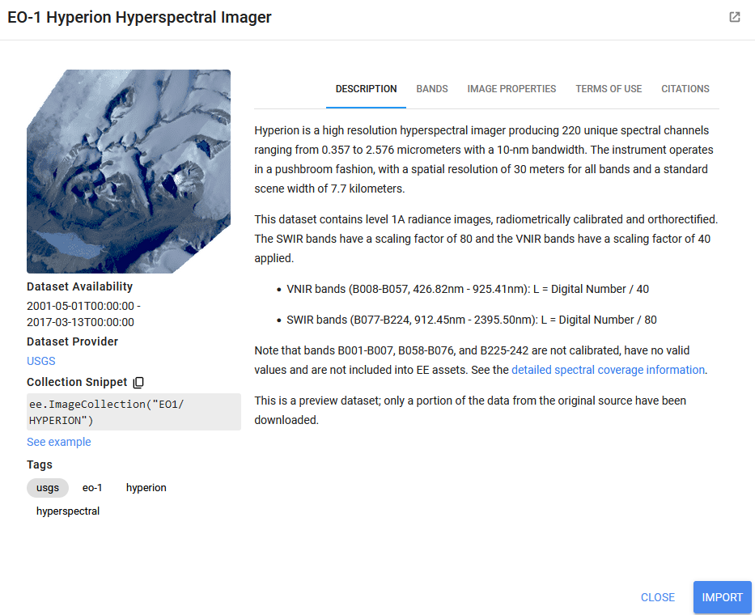
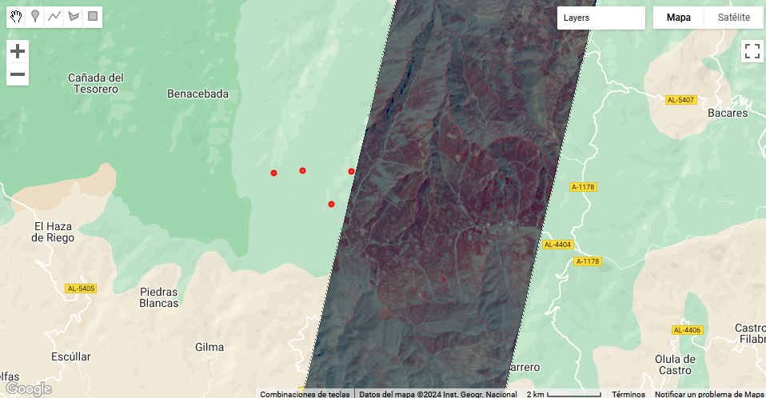
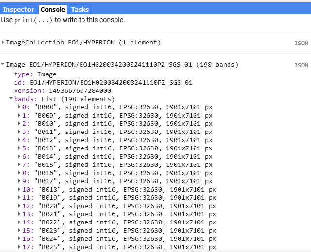
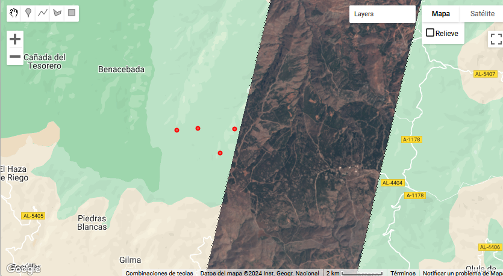
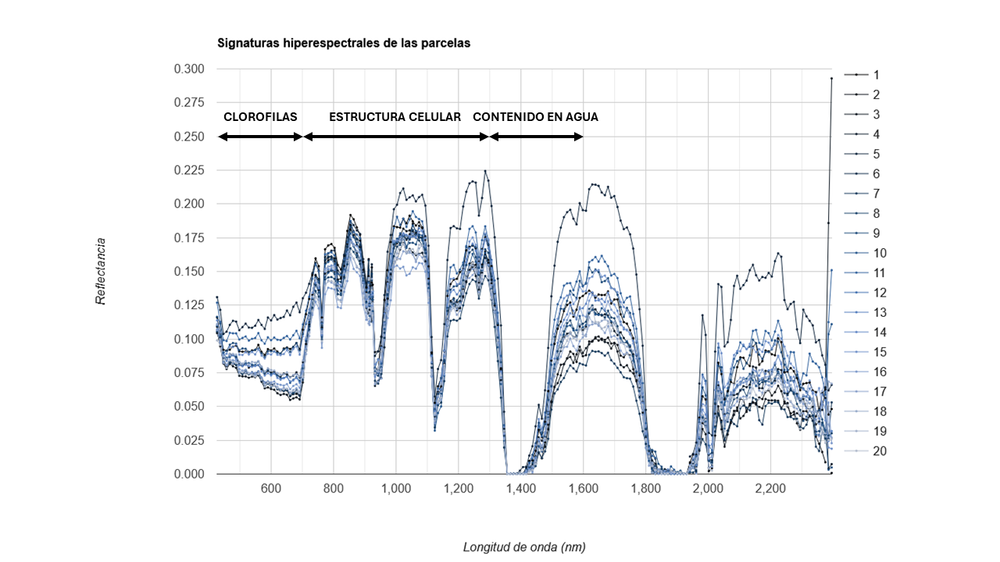
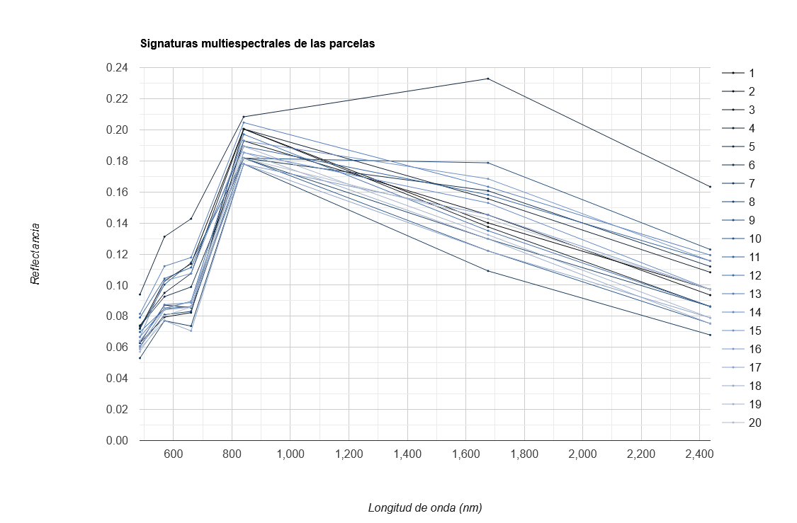

# Capitulo imagenes hiperespectrales

En el presente ejercicio se va a aprender a gestionar la búsqueda y descarga de datos de imágenes satelitales hiperespectrales empleando la plataforma de análisis geoespacial Google Earth Engine (GEE). También se incorporará un pequeño análisis del estado sanitario de una masa forestal. Para ello se van a emplear imágenes del sensor Hyperion a bordo del satélite EO-1 (Earth Observing 1) que estuvo operativo entre noviembre de 2000 y marzo de 2017. Recopila 220 canales espectrales únicos que van desde 357 nm a 2576 nm con un ancho de banda aproximado de 10 nm, con una resolución espacial de 30 metros para todas las bandas. Los datos se distribuyen mediante descarga sin costo a través de EarthExplorer o USGS Global Visualization Viewer (GloVis) además de GEE.

## 1. Búsqueda y visualización de imágenes hiperespectrales

Se va a trabajar a partir de la API Code Editor de Google Earth Engine (GEE) y por tanto es necesario cumplir con el registro en la plataforma, tal y como se indica en el capítulo destinado al mismo. 




A través del editor de código de GEE se va a la zona de estudio. Se parte de unas parcelas de la especia *Pinus sylvestris* en las que se midieron datos fisiológicos, entre ellos la conductancia estomática (GS, mmol$H_2$O · $m^-2$ · $s^-1$) medida a las 12:00 GMT, durante una campaña de campo en el verano del año 2008. La localización de las mismas se proporciona en una capa en formato shapefile dentro la carpeta Parcelas. Para poder trabajar con ella, primero es necesario tenerla importada en los **Assets**. 



Una vez ahí, al clicar sobre ella, se accede a los detalles del Asset, en donde se especifica la ubicación geográfica y otras características del mismo:



Al pinchar sobre *Import*, en la esquina superior derecha, se importa el Asset como una tabla para trabajar con él a través del editor de código en el script que hayamos creado. Una vez hecho esto, se puede acceder al mismo con el siguiente código:

``` js
// 01. Zona de estudio
var filabres = table;

Map.addLayer(filabres, {color: 'red'})
Map.centerObject(filabres, 10);
``` 

Si se guarda y se ejecuta (*Run*) se localizarán las parcelas en el mapa:



Ahora se buscan las imágenes hiperespectrales disponibles para la zona de estudio en la época de medición de las parcelas. Dentro de toda la información disponible en GEE, dentro de los datos dinámicos se encuentran imágenes de una única misión hiperespectral satelital, la misión "Hyperion", que estuvo en órbita desde 2001 hasta 2017. Dichas imágenes se componen de más de 200 bandas que miden desde el visible hasta el infrarrojo medio de onda corta en anchos de banda de 10 nm.



Para consultar la disponibilidad de esta colección de imágenes en la zona de estudio, así como para visualizarla se ejecuta el siguiente código:

``` js
//02. Imagenes hiperespectrales
var dataset = ee.ImageCollection('EO1/HYPERION')
                  .filter(ee.Filter.date('2008-07-01', '2008-09-01')) //Filtro temporal para el verano de 2008
                  .filter(ee.Filter.bounds(filabres));                //Filtro espacial para la zona de estudio

//Seleccion de bandas para visualizar la imagen como "Falso Color"
var rgb = dataset.select(['B050', 'B023', 'B015']);

//Parametros de visualizacion
var rgbVis = {
  min: 1000.0,
  max: 14000.0,
  gamma: 2.5,
};

//Descripcion en consola de la coleccion de imagenes 
print(dataset);

//Visualizacion de la mediana de los valores de la coleccion de imagenes
Map.addLayer(rgb.median(), rgbVis, 'RGB');

//Seleccionar la primer imagen de la coleccion
dataset = dataset.first();

//Descripcion en la consola de la imagen seleccionada
print(dataset);
```

Ahora se visualiza en la ventana de mapa la única imagen del sensor para la zona y la fecha introducidas. 



Y en la consola se puede acceder a las características de la misma.



Lamentablemente, la colección de imágenes de Hyperion no está convertida a valores de reflectancia, como sí lo están otras colecciones como la de Landsat. Es por ello, por lo que habrá que aplicar una serie de fórmulas que conviertan a la imagen en valores entendibles y comparables con otras escenas. En la descripción de la colección de imágenes, se indica que los valores de los píxeles están radiométricamente calibrados, pero que necesitan ser corregidos por un factor, que en las bandas de la 8 a la 57 toma el valor de 40 y en las bandas de la 77 a la 224, toma el valor de 80. 

```js
//Se crea una lista en la que se repite cada factor de escala por el número de bandas en las que va a ser aplicado
var kVNIR = ee.List.repeat(40, 57-8+1)    //Para las bandas de la 8 a la 57 del VNIR
var kSWIR = ee.List.repeat(80, 224-77+1)  //Para las bandas de la 77 a la 224 del SWIR

//Se concatenan ambas listas
var k = kVNIR.cat(kSWIR)

//Se aplica el factor de escala a las bandas de la imagen dividiendo cada una por su correspondiente constante y renombrarlas con su nombre original 
var radiancia = dataset.toFloat().divide(ee.Image.constant(k).rename(dataset.bandNames()))
```

Ahora es necesario convertir la radiancia a reflectancia. La siguiente fórmula se emplea individualmente sobre cada banda ([Thenkabail et al., 2004](https://www.sciencedirect.com/science/article/pii/S0034425703003560)]) de forma que la luz solar reflejada dependiendo de cada longitud de onda puede ser descrita así: 

```math
 \rho_{p} = \pi · L_{\lambda} · d^2 · ESUN_{\lambda} · cos \theta_{S}
```

Donde $\rho_{p}$ es la reflectancia exoatmosférica en el satélite, $L_{\lambda}$ es la radiancia en $W m^{-2} s r^{-1} \mu m^{-1}$, d es la distancia entre la tierra y el sol en unidades astronómicas el día de la adquisición de la imagen, $ESUN_{\lambda}$ es la irradiancia solar exoatmosférica media y $\theta_{S}$ es el ángulo zenital solar en grados.


```js
//Se calcula el día del año de la imagen
var fecha = ee.Date(dataset.get('system:time_start')); //Busca y obtiene de las características de la imagen cuándo fue tomada
var jan01 = ee.Date.fromYMD(fecha.get('year'), 1, 1);  //Se introduce el 1 de enero del año de toma de la imagen como día inicial
var doy = fecha.difference(jan01,'day').add(1);        //Se calcula el día del año de la imagen por diferencia con el 1 de enero.

//Distancia Tierra-Sol al cuadrado (d2) 
//Sigue las pautas de una ecuación descrita en http://physics.stackexchange.com/questions/177949/earth-sun-distance-on-a-given-day-of-the-year
var d = ee.Number(doy).subtract(4).multiply(0.017202).cos().multiply(-0.01672).add(1) 
    
var d2 = d.multiply(d)  
    
// Irradiancia solar exoatmosférica media (ESUN)
// https://eo1.usgs.gov/faq/question?id=21
var irradiances = [1650.52,1714.9,1994.52,2034.72,1970.12,2036.22,1860.24,1953.29,1953.55,1804.56,1905.51,1877.5,1883.51,1821.99,1841.92,1847.51,1779.99,1761.45,1740.8,1708.88,1672.09,1632.83,1591.92,1557.66,1525.41,1470.93,1450.37,1393.18,1372.75,1235.63,1266.13,1279.02,1265.22,1235.37,1202.29,1194.08,1143.6,1128.16,1108.48,1068.5,1039.7,1023.84,938.96,949.97,949.74,929.54,917.32,892.69,877.59,834.6,876.1,839.34,841.54,810.2,802.22,784.44,772.22,758.6,743.88,721.76,714.26,698.69,682.41,669.61,657.86,643.48,623.13,603.89,582.63,579.58,571.8,562.3,551.4,540.52,534.17,519.74,511.29,497.28,492.82,479.41,479.56,469.01,461.6,451,444.06,435.25,429.29,415.69,412.87,405.4,396.94,391.94,386.79,380.65,370.96,365.57,358.42,355.18,349.04,342.1,336,325.94,325.71,318.27,312.12,308.08,300.52,292.27,293.28,282.14,285.6,280.41,275.87,271.97,265.73,260.2,251.62,244.11,247.83,242.85,238.15,239.29,227.38,226.69,225.48,218.69,209.07,210.62,206.98,201.59,198.09,191.77,184.02,184.91,182.75,180.09,175.18,173,168.87,165.19,156.3,159.01,155.22,152.62,149.14,141.63,139.43,139.22,137.97,136.73,133.96,130.29,124.5,124.75,123.92,121.95,118.96,117.78,115.56,114.52,111.65,109.21,107.69,106.13,103.7,102.42,100.42,98.27,97.37,95.44,93.55,92.35,90.93,89.37,84.64,85.47,84.49,83.43,81.62,80.67,79.32,78.11,76.69,75.35,74.15,73.25,71.67,70.13,69.52,68.28,66.39,65.76,65.23,63.09,62.9,61.68,60,59.94]
var ESUN = irradiances
    
// Coseno del ángulo zenital solar (cosz)
var solar_z = ee.Number(ee.Number(90).subtract(dataset.get('SUN_ELEVATION')))
var cosz = solar_z.multiply(Math.PI).divide(180).cos()

// Calcular reflectancia
var scalarFactors = ee.Number(Math.PI).multiply(d2).divide(cosz)
var scalarApplied = ee.Image(radiancia).toFloat().multiply(scalarFactors)
var reflectancia = scalarApplied.divide(ESUN)

var viz = {bands: ['B032', 'B019', 'B012'],min:0, max:0.3} //Seleccion de bandas para visualizar la imagen como "color real"
Map.addLayer(reflectancia,viz,"image")
Map.centerObject(filabres,12)
```




## 2. Signaturas espectrales de vegetación con procesos de decaímiento

La respuesta espectral de cada una de las parcelas es diferente debido a las distintas condiciones a las que están sometidas. La reflectancia obtenida en las longitudes de onda del visible está asociado al contenido de clorofilas del dosel arbóreo. El comportamiento espectral en las longitudes de onda del infrarrojo cercano está ligado a las diferencias en la estructura celular. Finalmente el infrarrojo medio se ve influido principalmente por el contenido en agua. Así, pueden apreciarse mínimos cambios en la reflectivad espectral distribuida en todo el rango del espectro indicando las propiedades biofísicas y bioquímicas, así como estructurales y de humedad de las distintas parcelas.

```js
//03. Gráfico

//Paleta de colores
var paletas=require('users/gena/packages:palettes')
var viridisMio=paletas.crameri.oslo [25]

//Grafico de la firma espectral de los puntos
var options = {
  title: 'Signaturas hiperespectrales de las parcelas',
  hAxis: {title: 'Longitud de onda (nm)'},
  vAxis: {title: 'Reflectancia'},
  colors:viridisMio,
  lineWidth: 1,
  pointSize: 1
};

//Crear gráfico con las firmas espectrales
var spectraChart = ui.Chart.image.regions(
    reflectancia.select('B.*'), filabres, ee.Reducer.mean(), 30,'Id',wavelengths)
        .setChartType('LineChart').setOptions(options);

//Visualizar gráfico con las firmas espectrales en la consola
print(spectraChart);
```



Puede apreciarse cómo los datos de una imagen hiperespectral mejoran la capacidad de comprender, modelar, mapear y monitorear los procesos fisiológicos que ocurren en la vegetación, frente a datos multiespectrales de banda ancha, al compararse este resultado con el obtenido con una imagen Landsat de la misma fecha.

```js
var options2 = {
  title: 'Signaturas multiespectrales de las parcelas',
  hAxis: {title: 'Longitud de onda (nm)'},
  vAxis: {title: 'Reflectancia'},
  colors:viridisMio,
  lineWidth: 1,
  pointSize: 1,
};


//Comparativa con Landsat 5
var Landsat5 = ee.ImageCollection('LANDSAT/LT05/C02/T1_L2')
                  .filter(ee.Filter.date('2008-07-01', '2008-09-01'))
                  .filter(ee.Filter.bounds(filabres));

// Crear función para aplicar los factores de escalado de las imagenes Landsat5
function applyScaleFactors(image) {
  var opticalBands = image.select('SR_B.').multiply(0.0000275).add(-0.2);
  var thermalBand = image.select('ST_B6').multiply(0.00341802).add(149.0);
  return image.addBands(opticalBands, null, true)
              .addBands(thermalBand, null, true);
}

//Aplicar función de escalado
Landsat5 = Landsat5.map(applyScaleFactors);

//Crear gráfico con las firmas espectrales
var Chart1 = ui.Chart.image.regions(
    Landsat5.first().select('SR_B.'), filabres, ee.Reducer.mean(), 30,'Id',wavelengths2)
        .setChartType('LineChart').setOptions(options2);

//Visualizar gráfico con las firmas espectrales en la consola
print(Chart1);
```




## 3. Cálculo de índices en imágenes hiperespectrales


```js
//Modified Red Edge Normalized Difference Vegetation Index (NDVI705)
var NDVI705=reflectancia.normalizedDifference(["B035","B040"]);
print(NDVI705);
print(filabres);

Map.addLayer(NDVI705,{min:-1,max:1},'NDVI705');
var filabres_limites = filabres.geometry().bounds();
print(filabres_limites);

//Histograma del índice
var histograma1 =
    ui.Chart.image.histogram({
      image: NDVI705, 
      region: filabres_limites, 
      scale: 30})
        .setOptions({
          title: 'Hyperion NDVI705 Histogram',
          hAxis: {title: 'Reflectance'},
          vAxis:{title: 'Count'}});
print(histograma1);

var CRI2 = reflectancia.expression ('float ((1/(Banda1))-(1/(Banda2)))', {
    'Banda1': reflectancia.select ('B016'),  
    'Banda2': reflectancia.select ('B020')});

Map.addLayer(CRI2,{min:-1,max:1},'CRI2');
print(CRI2)

//Histograma del índice
var histograma2 =
    ui.Chart.image.histogram({
      image: CRI2, 
      region: filabres_limites, 
      scale: 30})
        .setOptions({
          title: 'Hyperion CRI2 Histogram',
          hAxis: {title: 'Reflectance'},
          vAxis:{title: 'Count'}});
print(histograma2);

//Indice VREI1
var VREI1 = reflectancia.expression ('float ((Banda1)/(Banda2))', {
    'Banda1': reflectancia.select ('B039'),  
    'Banda2': reflectancia.select ('B037')});

Map.addLayer(VREI1,{min:1,max:1.5},'VREI1');

//Histograma del índice
var histograma3 =
    ui.Chart.image.histogram({
      image: VREI1, 
      region: filabres_limites, 
      scale: 30})
        .setOptions({
          title: 'Hyperion VREI1 Histogram',
          hAxis: {title: 'Reflectance'},
          vAxis:{title: 'Count'}});
print(histograma3);

Map.addLayer(filabres, {color: 'red'});

```

